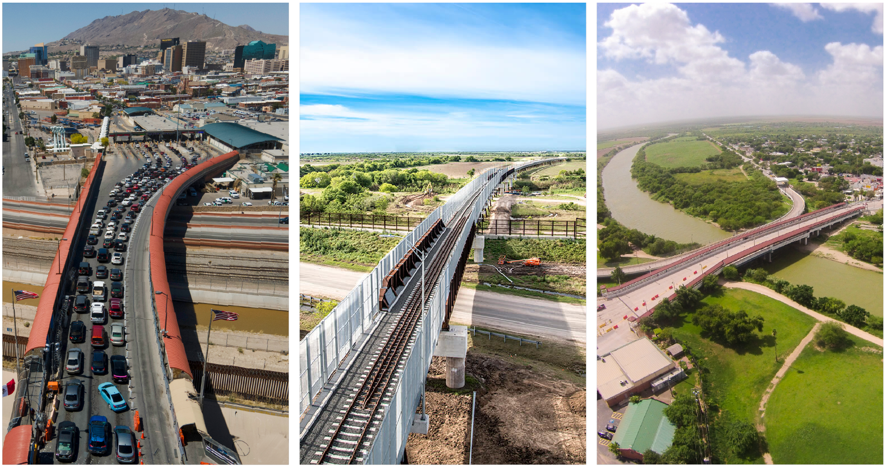

<!-- section: hero -->
# Texas-Mexico International Border Crossings
Connecting People and Goods Across the Texas-Mexico Border: A Guide to the State's Border Crossings

<!-- section: intro -->
This guide provides information about the importance of the Texas-Mexico border and the border crossings in three regions (El Paso, Laredo, and Rio Grande Valley). It presents trade and crossing volume data at two levels: (1) district aggregate totals showing total trade and crossing volumes for each region, and (2) individual crossing details for each Port of Entry and bridge.

The data covers trends in cross-border trade (by commercial truck and rail) and travel (by passenger vehicle, bus, and as a pedestrian/bicyclist) for the period 2014 to 2024, along with information on planned future international bridges and border crossings.

<!-- section: border-overview -->
## Texas-Mexico Border

Texas shares a **1,254-mile land border** with **four Mexican states** (Chihuahua, Coahuila, Nuevo Leon, and Tamaulipas), alongside a robust border infrastructure that facilitates and enhances the movement of people and goods through **34 operational border crossings** within **12 ports of entry** in Texas.

<!-- stats -->
- 1,254 | Miles of Border
- 4 | Mexican States
- 34 | Operational Crossings
- 12 | Ports of Entry

<!-- section: regions -->
## Three Border Regions

In Texas, border crossings are organized into three regions, each with unique trade and infrastructure characteristics.

<!-- region: el-paso -->
- title: El Paso Region
- image: ../assets/Transition-Images/ELP Region Photo.jpg
- alt: El Paso region border crossing
- link: el-paso.html
- link-text: Explore El Paso
- description: Four ports of entry with 10 operational border crossings and two airports. Seven crossings process pedestrians/bicyclists, seven process passenger vehicles, five process buses, four process commercial trucks, and two process railcars.

<!-- region: laredo -->
- title: Laredo Region
- image: ../assets/Transition-Images/Laredo.jpg
- alt: Laredo region border crossing
- link: laredo.html
- link-text: Explore Laredo
- description: Three ports of entry with 10 operational border crossings and two airports. Five crossings process pedestrians/bicyclists, seven process passenger vehicles, four process buses, four process commercial trucks, and two process railcars.

<!-- region: rgv -->
- title: Rio Grande Valley Region
- image: ../assets/Transition-Images/RGV.jpg
- alt: Rio Grande Valley region border crossing
- link: rio-grande-valley.html
- link-text: Explore Valley
- description: Five ports of entry with 14 operational border crossings, three airports, and a seaport. Ten crossings process pedestrians/bicyclists, 13 process passenger vehicles, eight process buses, six process commercial trucks, and one processes railcars.

<!-- section: map -->
## Interactive Border Crossings Map

Explore Texas' 34 border crossings across three regions: El Paso, Laredo, and the Rio Grande Valley.

[View Interactive Map](https://experience.arcgis.com/experience/0224d33cb25d48c09d551dc46d404ebe)

<!-- section: trade-role -->
## The Role of Texas' Border Infrastructure in U.S.-Mexico Trade

Mexico is the U.S. and Texas' most important international trading partner. In 2024, the U.S. and Mexico traded **$839.9 billion** in goods, of which nearly two-thirds (**$552.9 billion**) were processed at the Texas border regions.

**In the same year, Texas traded $281.2 billion in goods with Mexico: 3.7 times the value of Texas' trade with Canada, the State's second largest international trading partner.**

In addition, $271.7 billion in trade originating in or destined for other U.S. States or Canada that passed through the state was processed at the Texas border regions.

Of the $552.9 billion of U.S.-Mexico trade that was processed at the Texas border regions, $454.5 billion (82%) was transported by commercial truck and $88.8 billion (16%) was transported by rail.

Of the $552.9 billion of U.S.-Mexico trade processed at the Texas border regions in 2024, $213.9 billion was exports and $339.1 billion was imports.

### Top Commodities (2024)
* Machinery/electrical equipment
* Transportation equipment
* Metals
* Plastics/rubbers
* Mineral products

<!-- source -->
Source: Bureau of Transportation Statistics (BTS)

<!-- section: trade-trends -->
## Trade Trends (2014–2024)

The Texas-Mexico international bridges and border crossings serve as important gateways in facilitating trade.

<!-- stats -->
- +71% | Truck trade value increase
- +41% | Rail trade value increase
- $5.4B | Trade via pipeline (2024)

<!-- source -->
Source: Bureau of Transportation Statistics (BTS)

<!-- section: crossings -->
## Cross-Border Personal and Commercial Crossings

Strong cultural, family, and economic ties exist in the border regions. Residents from border communities cross the Texas-Mexico border daily to shop, work, and visit family and friends.

<!-- stats -->
- 17.5M | Pedestrians/bicyclists (2024)
- 35.1M | Passenger vehicles (2024)
- 5.4M | Commercial trucks (2024)
- 1.1M | Railcars (2024)

About 38% (6.7 million) of the pedestrians/bicyclists crossed at the Rio Grande Valley region and almost 37% (12.9 million) passenger vehicles entering the U.S. from Mexico crossed at the El Paso region.

Almost 63% (3.4 million) of the commercial trucks and 82% (0.9 million) of the railcars entering the U.S. from Mexico crossed at the Laredo region.

<!-- source -->
Source: U.S. Customs and Border Protection (CBP)

<!-- section: crossing-trends -->
## Crossing Volume Trends (2014–2024)

<!-- trend-card: descriptive -->
- title: Pedestrian/Bicycle
- text: Increased 23% from 2014 to 2019. Sharp reduction in 2020–2021 due to COVID-19. Crossings have since increased but have not reached 2019 volume.

<!-- trend-card: descriptive -->
- title: Passenger Vehicle
- text: Peaked in 2018 at 35.4 million. Overall increased 7% between 2014 and 2024, though crossings have yet to return to the 2018 peak.

<!-- trend-card: descriptive -->
- title: Bus
- text: Peaked in 2014 at 98,505. Similarly impacted by the COVID-19 non-essential travel ban. Overall declined 25% between 2014 and 2024.

<!-- trend-card: metric -->
- title: Commercial Truck
- value: +44%
- text: More than 1.6 million additional northbound commercial truck crossings between 2014 and 2024.

<!-- trend-card: metric -->
- title: Railcar
- value: +32%
- text: An increase of 262,806 northbound railcars between 2014 and 2024.

<!-- trend-card: metric -->
- title: Train Length
- value: 109
- text: Average railcars per train in 2024, up from fewer than 100 prior to 2018.

<!-- source -->
Source: U.S. Customs and Border Protection (CBP)

<!-- section: quick-facts -->
## Texas-Mexico Quick Facts

Download the Quick Facts infographic summarizing trade and crossing data at the Texas-Mexico border.

[Download Quick Facts (PDF)](https://tiger-unt.github.io/TX-MX-Border/Quick_Facts_PDF/Texas_Mexico_Border_2024_Quick_Facts_TX.pdf)
