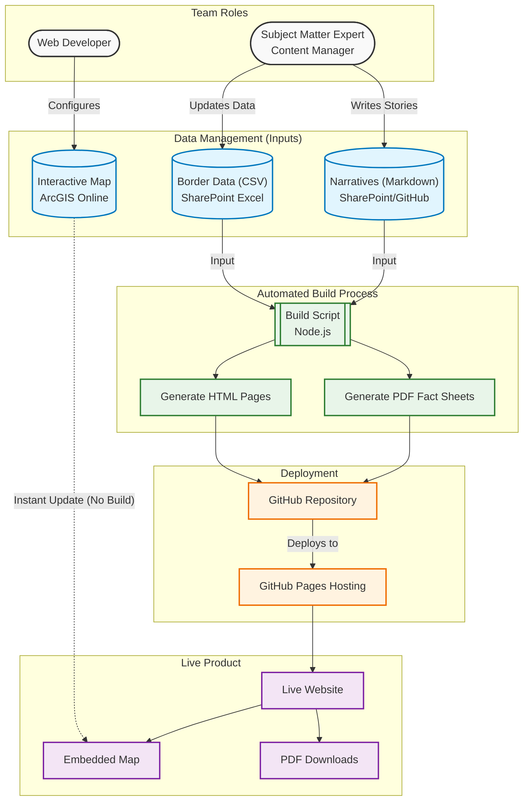
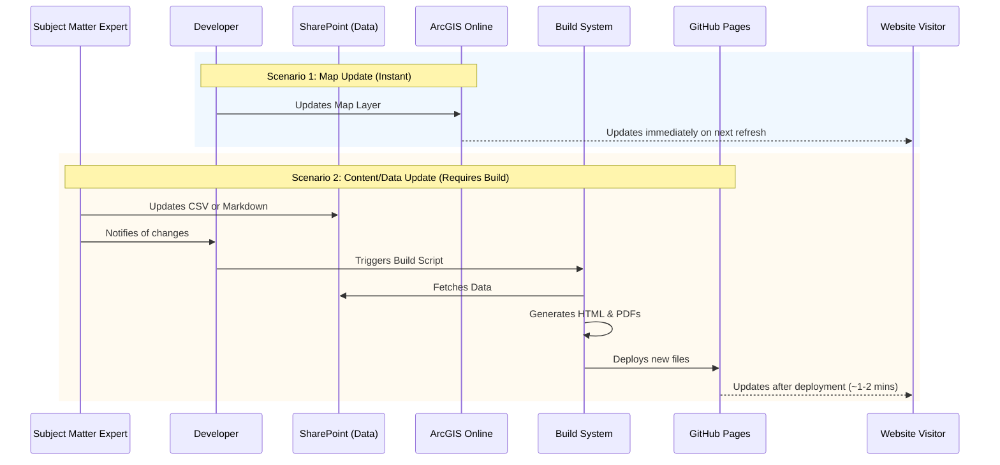

# Website Development Process Diagrams

These diagrams illustrate the content management, build, and deployment processes for the 2026 Texas-Mexico Border Crossings Guide website.

## 1. Architecture & Data Flow

## 2. Update Workflow Sequence

This sequence diagram shows the difference between updating the Map (Instant) vs. Content (Requires Build).

